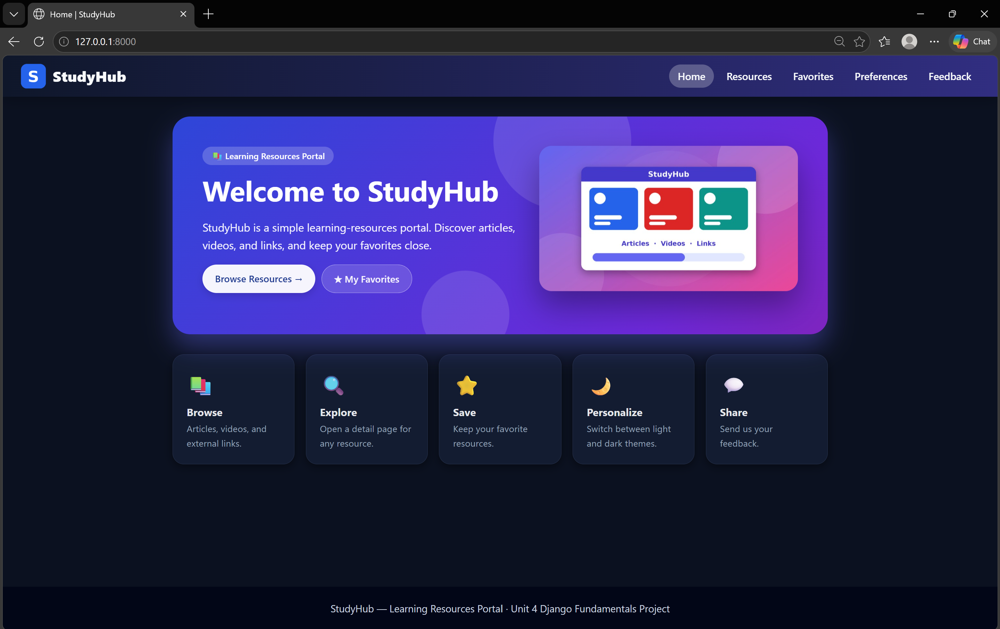
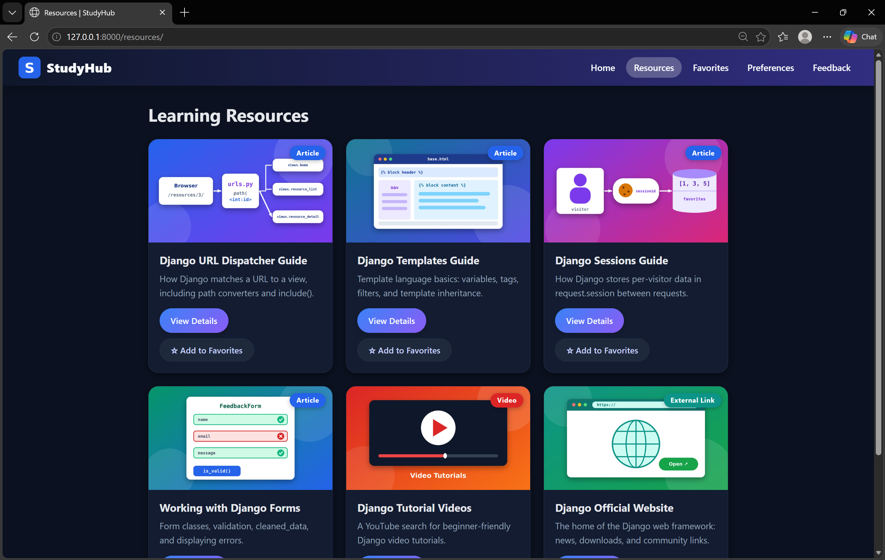
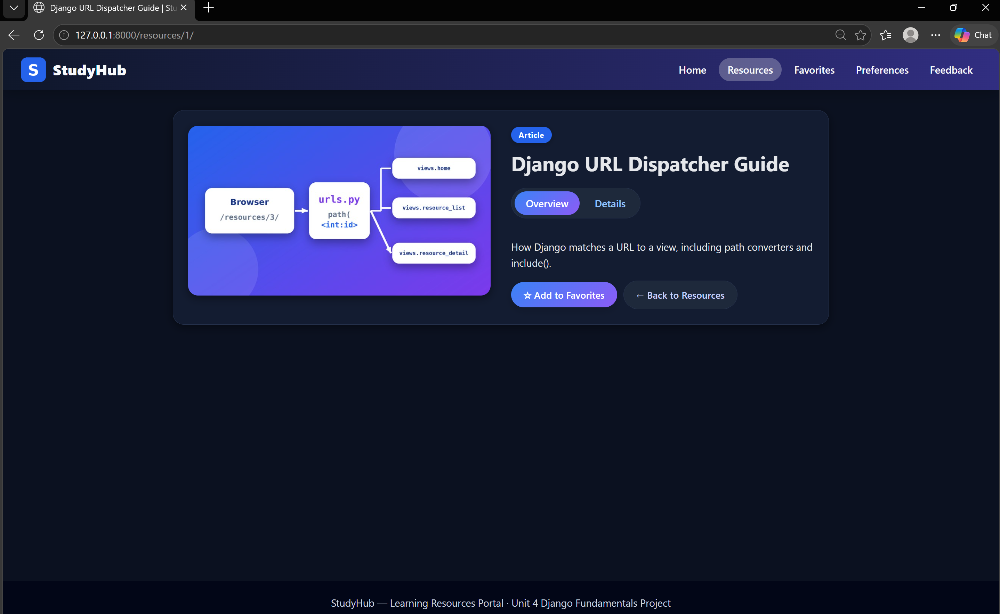
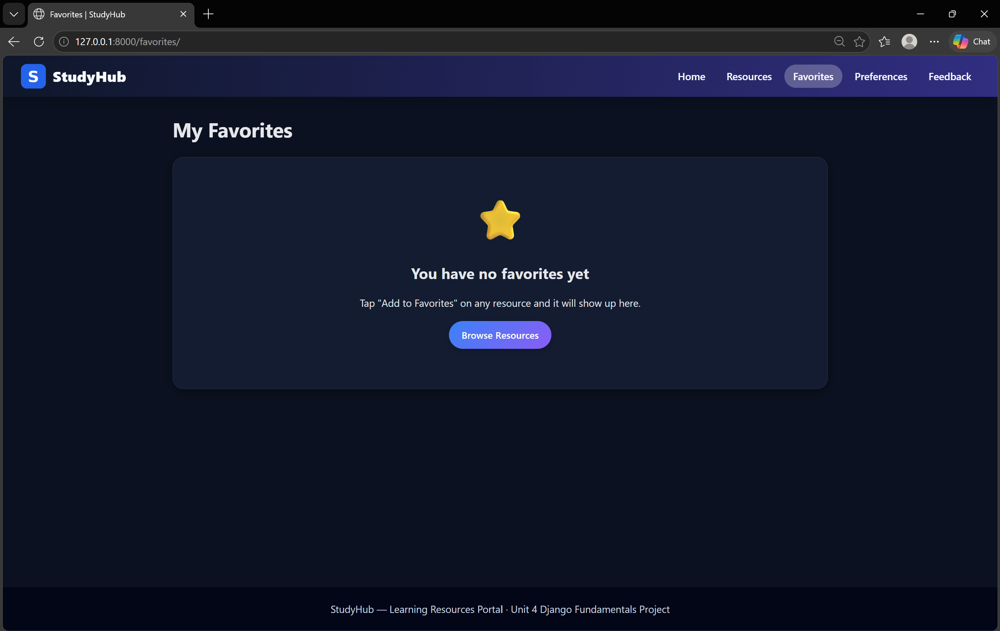
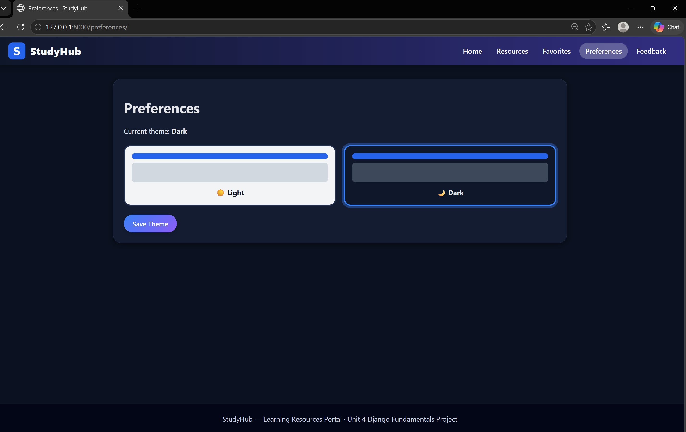
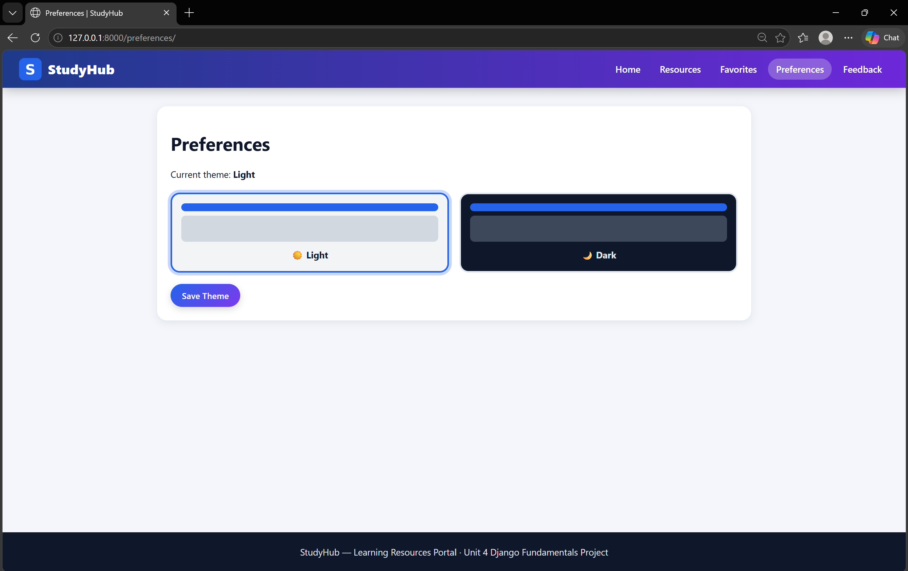
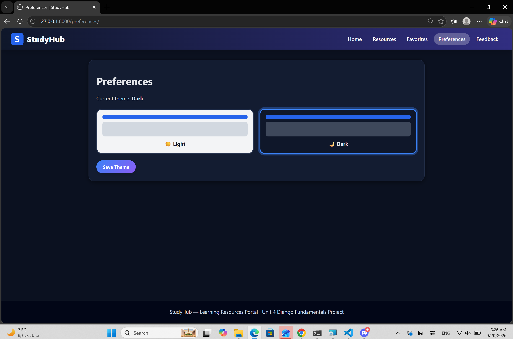
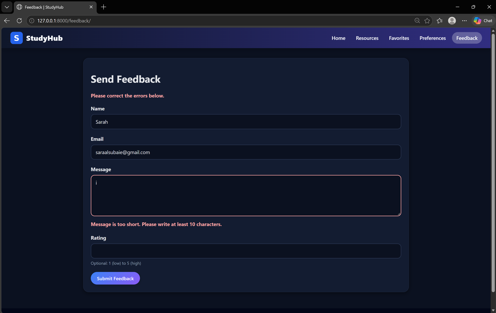
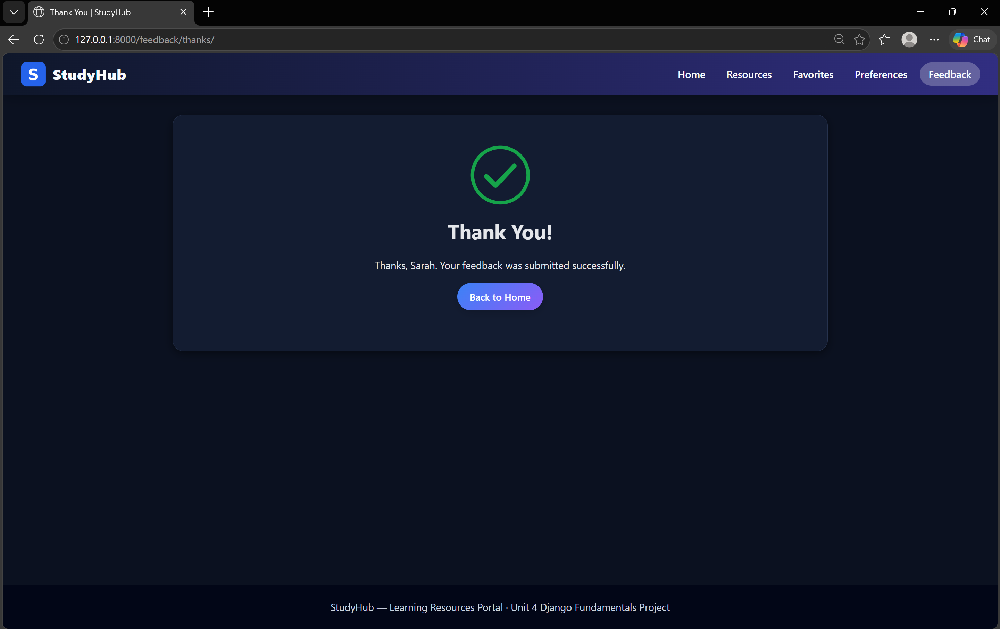

# StudyHub

A Django learning resources portal demonstrating routing, views, templates, forms, sessions, cookies, validation, redirects, custom 404 handling, and responsive UI.

## Features

- Browse learning resources
- View resource details with query parameters
- Add and remove favorites using Django sessions
- Light and dark theme preferences using cookies
- Feedback form with server-side validation
- Post/Redirect/Get after successful feedback
- Custom 404 page
- Responsive UI with CSS Grid and Flexbox
- CSS transitions and animations

## Django Concepts

| Concept | Implementation |
|---|---|
| URL Routing | Project and app URL configuration |
| Path Converters | `/resources/<int:id>/` |
| Query Parameters | Resource detail tabs |
| Views | Function-based Django views |
| Templates | Django Template Language and inheritance |
| Static Files | CSS and images |
| Cookies | Theme preference |
| Sessions | Favorites and temporary feedback data |
| Forms | `FeedbackForm` |
| Validation | Built-in and custom validation |
| Redirects | Post/Redirect/Get |
| CSRF | Protected POST forms |
| Error Handling | Custom 404 page |

## Main Routes

- `/` — Home
- `/resources/` — Resource list
- `/resources/<int:id>/` — Resource details
- `/favorites/` — Favorites
- `/preferences/` — Theme preferences
- `/feedback/` — Feedback form
- `/feedback/thanks/` — Successful submission

## Screenshots

### Home


### Resource List


### Resource Details


### Favorites


### Theme Preferences


<details>
<summary>More screenshots</summary>

### Light Theme


### Dark Theme


### Feedback Validation


### Feedback Success


</details>

## Technologies

- Python
- Django
- HTML5
- CSS3
- Django Templates
- SQLite — used as the project's database and for database-backed sessions

## Project Structure

```text
studyhub-django/
├── core/
│   ├── templates/core/
│   ├── apps.py
│   ├── forms.py
│   ├── urls.py
│   └── views.py
├── static/
│   ├── css/
│   └── images/
├── templates/
│   ├── 404.html
│   └── base.html
├── screenshots/
├── media/
├── studyhub_project/
│   ├── settings.py
│   ├── urls.py
│   ├── asgi.py
│   └── wsgi.py
├── manage.py
├── requirements.txt
└── README.md
```

## Running Locally

Create and activate a virtual environment:

```bash
python -m venv .venv
```

Windows PowerShell:

```powershell
.venv\Scripts\Activate.ps1
```

Install dependencies:

```bash
pip install -r requirements.txt
```

Apply migrations and run:

```bash
python manage.py migrate
python manage.py runserver
```

For a local development environment, Django runs with debug mode enabled by setting:

```text
DJANGO_DEBUG=True
```

For a deployed environment, use a strong `DJANGO_SECRET_KEY`, set `DJANGO_DEBUG=False`, and configure `DJANGO_ALLOWED_HOSTS`.

## Current Limitations

- Resources are currently predefined Python data rather than database models.
- Favorites are session-based rather than linked to user accounts.
- Feedback is validated but not stored permanently.
- Theme preferences are stored in a browser cookie.

## Future Development

- Add database models for resources
- Add authentication and user accounts
- Persist favorites per user
- Store feedback submissions
- Add search and filtering
- Add automated tests
- Prepare the project for deployment
- Continue improving accessibility and responsive behavior

## Author

**Sarah Alsubaie**

GitHub: https://github.com/Sarahibr8  
LinkedIn: https://www.linkedin.com/in/sarah-alsubaie-a41199217/
